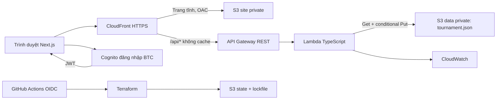

# Webminton — phân tích yêu cầu và thiết kế đề xuất

Ngày: 12/09/2026. Trạng thái: đề xuất để Huy duyệt trước khi lập trình. Phạm vi phiên này là phân tích và lập kế hoạch; chưa triển khai ứng dụng hay AWS.

## 1. Bằng chứng từ repository và assets

Repository hiện chỉ có assets, chưa có mã ứng dụng hoặc commit. Đã đọc ba poster `assets/poster_designs/thong-bao-trang-{1,2,3}.jpg` và giá trị/công thức trong 10 sheet của `assets/reports/giai-cau-long-noi-bo-2026.xlsx`.

| Nguồn | Nội dung áp dụng |
|---|---|
| Thể lệ C5:C14 | Giải cầu lông nội bộ 2026; Hội lông thủ CN1416; cuối tháng 10/2026, chưa chốt ngày; sân Tấn Phúc; lệ phí chưa chốt |
| Thể lệ B17:B34 | 4 đội; 3 nội dung; 18 trận vòng loại; 6 trận tranh hạng; luật 21/25; thứ tự xếp hạng |
| VĐV B8:G47 | Cấu trúc tên, giới tính, đội, điện thoại, đóng phí, ghi chú. Chỉ có một dòng ví dụ B8:G8, không có danh sách thật |
| Đội hình B5:B8, A11, A27 | Đỏ, Xanh, Vàng, Trắng; cần 8 nữ cho đôi nữ; được đổi cặp ở vòng tranh hạng, giữ bí mật trước khi gọi |
| Vòng loại H6:I8 | Ba kết quả mẫu 21–18, 19–21, 25–24, phải loại khỏi dữ liệu production |
| BXH A4:K10 | Tổng điểm ghi → số trận thắng → hiệu số → BTC phân định đối đầu |
| Tranh hạng A4:G22 | Nhất–nhì và ba–tư; mỗi cặp đội đánh đủ 3 nội dung; thắng ít nhất 2 nội dung |
| Lịch sân A5:P31 | 24 trận; sân và khung giờ; cảnh báo trùng sân/trùng người |
| Thu chi A5:E29 | Thu phí, tài trợ, BTC 1.000.000đ, quỹ CLB, thu khác; 8 khoản chi; tính thiếu hụt/người làm tròn lên 1.000đ |
| Tài trợ A11:E33 | Kim cương, Vàng, Thân thiện; có trường hợp đồng tài trợ bằng tiền |
| Vinh danh A4:H28 | 4 giải đội, giải từng nội dung theo vòng loại, lịch sử mùa |
| Poster 1 | Vàng, đỏ, đen, trắng ngà; chữ to, viền dày, bóng cứng; khẩu hiệu “Đánh hết sức · Thua hết hồn · Nhậu hết mình”; tối thiểu 16, lý tưởng 24 người |
| Poster 2 | Đến trước 10 phút; quá 10 phút từ lúc gọi bị xử thua; chưa quy định điểm số xử thua |
| Poster 3 | Tài trợ và công khai thu chi sau giải; Kim cương diễn đạt là một suất duy nhất |
| assets/images/momo-qr-code.jpeg | Có ảnh QR riêng; cần BTC xác nhận người nhận trước khi bật công khai |

Không nhập công thức Excel làm logic ứng dụng. Có các điểm không nhất quán:

- `Đội hình!A27` nói cặp tranh hạng trống sẽ dùng vòng loại, nhưng `Tranh hạng!A22` nói để trống thì không hiện cặp. Đề xuất sao chép cặp vòng loại thành bản nháp riêng khi tạo tranh hạng; BTC duyệt rồi công bố.
- `Lịch sân!C28:C29` tham chiếu nhãn trao giải ở `Tranh hạng!A19:A20`, không phải tên nội dung; dùng ID trận và category thay vì vị trí ô.
- Tài trợ dùng `LARGE(...,2)`, có thể không tạo hạng Vàng khi hai người đồng mức cao nhất. Huy đã chốt xếp theo mức tiền phân biệt; đồng mức cùng hạng, mức phân biệt kế tiếp nhận Vàng.
- BXH dùng số gộp có cột “Cộng tay”; ứng dụng dùng so sánh từng tiêu chí. Quyết định tay chỉ phá hòa thực sự, không làm thay đổi tổng điểm.
- Không tự suy ra ngày, lệ phí, số sân, trình độ VĐV, số điện thoại BTC, danh sách thật.

## 2. Backend và kiến trúc

| Phương án | Đánh giá |
|---|---|
| **TypeScript + AWS Lambda + API Gateway REST** | Đề xuất. Chung kiểu dữ liệu với Next.js, chạy theo request, sát kiến trúc mẫu, phù hợp ít người quản trị và JSON nhỏ |
| Next.js toàn bộ frontend/backend trên runtime SSR AWS | Ít project hơn nhưng cần nền tảng chạy Next.js động; không còn static export đơn giản như mẫu |
| FastAPI + Lambda | Khả thi, thích hợp đội ngũ Python; thêm ngôn ngữ và công cụ build, ít lợi ích cho bài toán hiện tại |

Đã đối chiếu `/Users/huyng/ws/aws-serverless-webapp/docs/architecture.md`, `backend/src/repository.ts`, `infra/modules/{frontend,api}/main.tf`, `infra/bootstrap/main.tf`, `.github/workflows/{ci,deploy}.yml`.



Giữ CloudFront, S3 site private/OAC, REST API, Lambda, Cognito và GitHub OIDC. Thay DynamoDB ứng dụng bằng S3 data riêng; dùng S3 lockfile cho Terraform thay lock table. Chỉ endpoint admin cần authorizer; Lambda kiểm tra group `admins`, không chỉ kiểm tra đã đăng nhập. Tắt self-signup; BTC được tạo tài khoản trước. Dùng Cognito access token với resource-server scope `tournament/admin` và Authorization Code + PKCE.

Next.js static export (`output: 'export'`, `trailingSlash: true`) cho các đường dẫn cố định; client tải dữ liệu JSON qua API. Không dùng Server Actions, SSR hoặc API routes Next.js. CloudFront Function rewrite `/van-dong-vien/` thành `/van-dong-vien/index.html` trên behavior site, không rewrite API. Bỏ fallback 403/404→200/index.html của mẫu để không nuốt lỗi API. Giữ `/api` làm stage, không thêm origin path trùng `/api`.

MVP một giải đang hoạt động, định danh `noi-bo-2026`, không làm nền tảng nhiều CLB. Region mặc định đề xuất `ap-southeast-1`; CloudFront domain trước, custom domain/ACM khi có tên miền. Dùng Node.js 24, Terraform >=1.10,<2; khóa phiên bản Next.js, pnpm, AWS provider và actions tại lúc khởi tạo sau khi kiểm tra tương thích, không sao chép version từ mẫu.

S3 JSON phù hợp giải nhỏ, nhưng mỗi thay đổi ghi lại toàn bộ tài liệu và mọi admin chia sẻ một điểm tranh chấp. Giới hạn tài liệu 1 MiB, request 256 KiB, cảnh báo khi gần giới hạn; không lưu ảnh/base64 trong JSON. Chưa cần WebSocket, Redis, VPC, ECS hoặc database khác.

## 3. Trang và quyền

| Route | Chức năng |
|---|---|
| `/` | Landing theo poster; thông tin, khẩu hiệu, thể lệ, tài trợ, liên hệ Zalo; ngày/phí chưa chốt phải hiển thị đúng trạng thái |
| `/van-dong-vien/` | Danh sách tên, giới tính nếu được công bố, đội; tìm kiếm/lọc; BTC quản lý danh sách bằng JSON config thủ công; ghi nhận đóng phí ở trang thu chi |
| `/boc-tham/` | Vòng quay tên cho BTC, xem đội đã công bố cho khách; cân bằng giới tính, nhóm trình độ và số lượng |
| `/lich-thi-dau/` | 18 trận vòng loại + BXH + hai nhánh tranh hạng, tên VĐV khi được công bố; tab lịch sân; BTC đổi thứ tự, cặp, sân, giờ, điểm |
| `/thu-chi/` | BTC quản lý thu/chi/tài trợ; khách chỉ xem báo cáo được BTC công bố |
| `/quan-tri/` | Đăng nhập, cấu hình giải/luật, quản lý xuất bản, xem lịch sử và khôi phục dữ liệu |

Toàn bộ nội dung, validation, lỗi, trạng thái rỗng, accessibility label và ngày tiền của ứng dụng bằng tiếng Việt. `lang=vi`, locale `vi-VN`, timezone `Asia/Ho_Chi_Minh`, tiền integer VND. Màu thiết kế đề xuất #FFD644, #E63D27, #17150F, #FFFDF4, #19945A (ước lượng từ poster, không phải màu đo chính xác). Dựng nội dung HTML responsive; poster gốc làm tham chiếu và ảnh xem thêm, không dùng một ảnh dài thay toàn bộ giao diện. Chọn font hỗ trợ dấu Việt, tiêu đề tròn đậm; viền 3px, bóng lệch 6px; trang vận hành ưu tiên đọc bảng. Bàn phím, focus, reduced motion và nút chọn thay thế kéo thả/vòng quay là bắt buộc.

Huy đã chọn BTC quản lý danh sách VĐV thủ công bằng JSON config; không xây form đăng ký, CRUD VĐV hoặc import Excel trong giao diện MVP. Không xuất điện thoại, ghi chú, tình trạng phí cá nhân, nội dung nháp, audit hoặc đội hình bí mật trong response public. Chỉ ẩn bằng UI là không đủ. Khách không được truy cập data bucket. Tài chính chỉ public khi `finance.published=true`.

## 4. Hợp đồng JSON và API

Một object canonical `tournaments/noi-bo-2026/tournament.json`, có S3 versioning. Tài liệu giữ cả dữ liệu gốc và kết quả dẫn xuất do server tính lại trong cùng lần ghi:

```typescript
type Category = 'mens_doubles' | 'womens_doubles' | 'mixed_doubles';
type Score = { a: number; b: number };
type Pair = [string, string]; // athlete IDs, hai người khác nhau
interface Athlete {
  id: string; name: string; gender: 'male' | 'female';
  skillBand: 1 | 2 | 3 | null; teamId: string | null;
  phone: string | null; note: string; active: boolean;
}
interface Team { id: string; name: string; color: string; captainId: string | null }
interface Match {
  id: string; phase: 'group' | 'first_place' | 'third_place';
  encounterId: string; category: Category; order: number;
  teamAId: string | null; teamBId: string | null;
  pairA: Pair | null; pairB: Pair | null; lineupPublished: boolean;
  courtId: string | null; startsAt: string | null; endsAt: string | null;
  status: 'pending' | 'called' | 'completed' | 'walkover';
  score: Score | null; winnerTeamId: string | null;
}
interface TournamentDocument {
  schemaVersion: 1; revision: number; id: string; updatedAt: string;
  info: { name: string; clubName: string; slogan: string; location: string;
    startsAt: string | null; dateLabel: string; registrationDeadline: string | null;
    timezone: 'Asia/Ho_Chi_Minh'; feeVnd: number | null;
    contactName: string | null; contactPhone: string | null; zaloUrl: string | null;
    qrAssetPath: string | null; qrPublished: boolean };
  rules: { teamCount: 4; categories: Category[]; setTarget: 21; cap: 25;
    changeEndsAt: 11; minLead: 2; ranking: ['pointsFor','wins','difference','manualHeadToHead'];
    placementWins: 2; lateMinutes: 10; walkoverScore: { winner: 21; loser: 0 } };
  athletes: Athlete[]; teams: Team[]; matches: Match[];
  courts: Array<{ id: string; name: string }>;
  draw: { status: 'not_started' | 'draft' | 'confirmed'; algorithmVersion: string;
    seed: string | null; rosterHash: string | null; assignment: Record<string,string> };
  tieDecisions: Array<{ tiedTeamIds: string[]; orderedTeamIds: string[];
    reason: string; decidedBy: string; sourceResultsHash: string }>;
  sponsorships: Array<{ id: string; name: string; amountVnd: number;
    received: boolean; note: string; tierOverride: string | null }>;
  finance: { published: boolean;
    feePayments: Array<{ id: string; athleteId: string; amountVnd: number; receivedAt: string }>;
    income: Array<{ id: string; label: string; amountVnd: number; received: boolean }>;
    expenses: Array<{ id: string; label: string; quantity: number; unitPriceVnd: number;
      paid: boolean; note: string }> };
  results: { standings: Array<{ teamId: string; played: number; pointsFor: number;
    pointsAgainst: number; wins: number; difference: number; rank: number | null }>;
    champion: string | null; runnerUp: string | null; third: string | null;
    consolation: string | null; finalized: boolean;
    categoryWinners: Partial<Record<Category,string[]>> };
  audit: Array<{ id: string; actorSub: string; action: string; at: string; revision: number }>;
  requests: Array<{ id: string; actorSub: string; payloadHash: string; committedRevision: number }>;
}
```

**Quản lý roster JSON:** Admin export `{etag, athletes}` từ bản S3 hiện tại bằng công cụ local đã đăng nhập, sửa mảng athletes thủ công trong file private ngoài Git, validate và xem diff rồi apply qua command `replaceRoster` với ETag gốc. Payload chỉ có athletes; server giữ nguyên điểm, tài chính và phần còn lại, ghi bằng CAS, audit và tính lại derived data. Dùng ID ổn định, không merge theo tên; từ chối ID trùng/tham chiếu hỏng hoặc xóa người đã có trận/payment. Khóa thay đổi roster ảnh hưởng đội sau khi draw confirmed, yêu cầu reset theo quy trình; đổi tên cùng ID vẫn được, không đổi thành viên. Đây là chỉnh config JSON thủ công, không cần form quản lý VĐV và không upload đè toàn bộ tournament.json không điều kiện. Excel chỉ làm tài liệu tham chiếu.

Schema Zod là nguồn type/validation. Không gửi nguyên document lên để ghi; dùng command có field allowlist. Seed khởi tạo có athletes=[], matches chưa có điểm, không có nhà tài trợ giả; khoản BTC 1.000.000đ là cam kết (`received=false`) cho tới khi xác nhận thu. Demo/test fixture phải tách production. Quy tắc cấu hình MVP cố định thể thức trên; không cho đổi số đội/đích điểm tùy ý. Các thay đổi thể thức như bỏ đôi nữ cần quyết định BTC và cập nhật engine/test trước khi chạy giải.

| API (cùng origin, `/api` prefix) | Quyền / tác dụng |
|---|---|
| GET `/public/tournament` | Public projection đã lọc; no-store; không lộ canonical ETag |
| GET `/admin/tournament` | Admin document + ETag |
| POST `/admin/commands` | Admin; `{requestId, type, payload}`, `If-Match` bắt buộc |
| GET `/admin/versions` | Admin, danh sách metadata version giới hạn/phân trang |
| POST `/admin/restore` | Admin, `{requestId,versionId,reason}`, If-Match; validate, tính lại, ghi version mới |

Command types: `configureTournament`, `replaceRoster`,  `renameTeam`, `generateDraw`, `confirmDraw`, `resetDraw`, `setLineup`, `publishLineup`, `reorderMatches`, `setSchedule`, `setScore`, `setWalkover`, `resolveTie`, `resetPlacement`, `upsertSponsor`, `recordFeePayment`, `upsertIncome`, `upsertExpense`, `publishFinance`, `finalizeTournament`. Payload lấy đúng field của entity liên quan; server sinh id/derived fields, audit actor lấy từ JWT. Không có command tự đặt champion.

Mỗi mutation: đọc S3 → kiểm tra requestId (trùng cùng actor/payload trả kết quả đã ghi, khác payload trả 409) → so If-Match → validate quyền/schema/business → tính lại standings/results → thêm audit/request record → tăng revision → PutObject với ETag vừa đọc. Khởi tạo chỉ `IfNoneMatch:'*'`; không tự tạo lại khi object bị mất. S3 412/409 ánh xạ HTTP 409 tiếng Việt; thiếu If-Match 428; input không hợp lệ 422; không auth 401; không đủ group 403. Không blind retry business command khi có conflict. UI giữ form nháp và cho tải lại/so sánh. RequestId do client tạo một lần, giữ nguyên khi retry timeout; lưu cùng canonical document. Ngân sách document áp dụng cả audit/idempotency, vượt giới hạn thì báo vận hành, không âm thầm xóa lịch sử.

## 5. Luật tính toán và trạng thái

**Điểm hợp lệ:** số nguyên không âm. Với `hi=max(a,b), lo=min(a,b)`: `(hi===21 && lo<=19) || (hi>=22 && hi<=24 && lo===hi-2) || (hi===25 && (lo===23 || lo===24))`. 21–20, 22–19, 25–22, 26–24 đều sai. Điểm trống là chưa đánh, không phải 0–0. Đổi sân lúc 11 là hướng dẫn, không cần hệ thống ghi từng pha.

**Xử thua:** BTC chọn bên vắng và ghi lý do bằng `setWalkover`; server đặt status=walkover, score=21–0 hoặc 0–21 theo phía đội thắng, tính điểm/BXH/tranh hạng như kết quả hoàn tất. Không tự xử thua bằng đồng hồ.

**Vòng loại:** tạo 6 cặp đội không lặp × 3 categories = 18 trận; mỗi đội 9 trận. Chỉ cộng các kết quả completed hoặc walkover hợp lệ. Sắp pointsFor giảm dần, wins giảm dần, difference giảm dần. Nếu vẫn hòa thì hiển thị đồng hạng/chờ BTC, không chọn theo tên/ID. Tie decision có lý do và chữ ký kết quả; sửa điểm làm quyết định hết hiệu lực. Không seed tranh hạng khi chưa xong cả 18 trận hoặc còn tie.

**Tranh hạng:** tự gán hạng 1–2 và 3–4, tạo 6 trận. Không có bán kết loại trực tiếp. Thắng 2/3 xác định đội thắng cặp, nhưng trận thứ ba vẫn cần thi đấu. Chỉ finalize mùa khi đủ 24 kết quả hợp lệ. Cặp vòng loại được copy sang bản nháp tranh hạng, server giấu tới lúc gọi tên/công bố. Giải từng nội dung lấy số trận thắng vòng loại; đồng mức thì lưu nhiều đội cùng thắng, không tự chọn hàng Excel đầu tiên.

**Sửa dữ liệu có phụ thuộc:** trước khi tranh hạng có trận called/completed, sửa vòng loại được reseed nguyên tử và hủy công bố lineup bị ảnh hưởng. Sau đó chặn sửa vòng loại làm thay đổi seed, yêu cầu BTC preview và chạy `resetPlacement` với lý do rồi mới sửa. Sửa cặp của trận đã có điểm phải xác nhận xóa điểm trận đó; tính lại downstream trong cùng command. Khóa đổi roster/draw/rules khi đã bắt đầu thi đấu; reset có chủ đích mới mở lại. Đổi tên VĐV cập nhật nhãn theo ID, không tạo VĐV mới. Không xóa VĐV đã tham gia; dùng inactive.

**Lịch:** order là permutation duy nhất toàn bộ match IDs; không đổi ID khi kéo thả. Chọn VĐV từ đội tương ứng, hai người khác nhau, đúng giới tính category. Kiểm tra khoảng giờ giao nhau cho sân và VĐV, không chỉ cùng chuỗi giờ; chặn lưu xung đột. Người có thể đánh nhiều nội dung ở những giờ khác nhau. Tên còn bí mật không xuất hiện ở endpoint lịch public.

**Bốc thăm:** cần ít nhất 2 nam và 2 nữ/đội cho ba nội dung; người có thể chơi đôi cùng giới và đôi nam nữ. `skillBand` bổ sung do Excel thiếu. BTC gán 1/2/3 (1 cao nhất); thiếu trình độ thì chặn bốc thăm cân bằng. Backend sinh seed ngẫu nhiên mật mã, thuật toán có version: chia nam/nữ, sort skillBand, shuffle trong mỗi band bằng PRNG seeded, phân người vào đội có ít người cùng giới nhất, rồi ít tổng người nhất, rồi tổng sức mạnh thấp nhất, random tie. Sức mạnh=4-skillBand. Chỉ nhận phương án thỏa 2 nam/2 nữ mỗi đội và chênh tổng người <=1; nếu thuật toán chưa tìm được phương án trong 100 lần thử thì báo không tìm được, không khẳng định bất khả thi. Công khai phương án và độ lệch trình độ trước xác nhận; không hứa tối ưu toàn cục hay ngẫu nhiên đều mọi cách chia.

Kết quả draft phải được lưu trước hoạt ảnh; vòng quay diễn lại allocation backend, mỗi người xuất hiện một lần. Reload/resume không bốc lại; xác nhận cùng requestId không nhân đôi. RosterHash thay đổi làm draft hết hiệu lực. Không đủ nữ thì báo rõ cần BTC sửa thể thức, không tự đổi category.

**Thu chi:** tiền nguyên VND. Lệ phí thực thu từ feePayments, tài trợ thực thu từ sponsorships.received; không cộng lại dưới income. Tách tổng cam kết/ngân sách với tiền đã nhận/đã trả. Expense amount = quantity × unitPriceVnd, kết quả phải nguyên VND. Thu khác không âm, điều chỉnh sai ghi sửa có audit. Số dư thực tế = thực thu − thực chi. Dự kiến góp thêm = ceil(max(0,ngân sách chi−nguồn thu cam kết)/activeAthletes/1000)×1000; 0 VĐV trả null + giải thích. Tổng đề xuất không tự tạo thanh toán. Import trạng thái “Rồi” khi phí chưa chốt phải yêu cầu số tiền thực, không suy ra 0đ đã thanh toán.

## 6. Terraform, CI/CD và vận hành

`infra/bootstrap` tạo S3 state private/versioning + IAM OIDC provider/roles có trust giới hạn repo và GitHub Environment; tái sử dụng provider sẵn có bằng input nếu account đã có. Bootstrap một lần bằng danh tính vận hành, migrate state ra remote, không đưa state vào Git. `infra/modules/{data,auth,compute,api,frontend,observability}` và `infra/envs/{dev,prod}` tách state/data/site.

Data bucket: Block Public Access, SSE, HTTPS-only, versioning, prevent_destroy, không force_destroy. Lambda chỉ Get/Put key giải và quyền đọc version cần cho restore; không DeleteObjectVersion. Site deploy role không ghi data. Terraform không quản lý nội dung tournament.json; workflow thường không seed/reset data. Restore đọc version cũ, validate/migrate, tính lại, ghi version mới bằng CAS; giữ audit restore và revision hiện tại tăng dần. Backup S3 versioning không thay cho bài diễn tập restore.

CloudWatch retention 30 ngày, không log body/JWT/điện thoại; alarm Lambda errors/throttles và API 5xx, có dashboard và hướng dẫn chọn SNS email người nhận. Client refresh khi focus và polling 15 giây trên lịch, dừng khi tab ẩn, hiển thị lần cập nhật gần nhất và lỗi mạng. Chưa hỗ trợ sửa offline.

CI chạy PR và main: frozen install, format/lint/typecheck, unit/API tests, static build, Playwright trên bản export, Terraform fmt/init backend=false/validate, tflint, checkov, actionlint. Fork PR không có AWS/OIDC/secrets. Remote plan chỉ từ trusted main hoặc manual workflow trên protected ref, tránh chạy mã PR tùy ý với quyền đọc state. Deploy main bắt buộc needs quality cùng SHA, build artifact, assume OIDC, plan saved file rồi apply đúng file, build frontend với outputs, upload assets trước HTML, invalidate HTML, smoke public/admin/route refresh. Production GitHub Environment có approval/restrictions do Huy cấu hình khi đưa lên thật. Không dùng `pull_request_target` để checkout PR.

Serialize deployment từng environment (`cancel-in-progress:false`). Giữ release artifacts cho rollback; rollback site/backend cùng schema tương thích. Không rollback tournament data tự động khi rollback code. Dùng expand/migrate contract cho schema, backup trước migration và staging test. Không chạy sync --delete với bucket data; giữ chunk cũ khi triển khai để tránh tab đang mở mất tài nguyên.

## 7. Quyết định đã chốt và thông tin vận hành còn thiếu

Huy đã xác nhận:

1. Admin quản lý danh sách VĐV thủ công bằng JSON config.
2. BTC gán skillBand 1–3, bốc thăm cân bằng giới tính, trình độ và số lượng.
3. Giữ mặc định đôi nam, đôi nữ, đôi nam nữ; thay đổi thể thức phụ thuộc đăng ký thực tế và quyết định sau của BTC. Không tự bỏ/thay đôi nữ khi thiếu người.
4. Một bên có VĐV vắng mặt bị xử thua 0–21; đối phương thắng 21–0.
5. Thu chi chỉ admin xem cho tới khi BTC công bố.
6. Tài trợ bằng tiền cùng hạng; hạng Vàng lấy mức tiền phân biệt kế tiếp sau mức cao nhất.

Còn cần trước triển khai/công bố: ngày/phí/liên hệ/QR, AWS account/repo/domain, số sân và danh sách thật. Không publish dữ liệu chưa xác nhận như thông tin thật. Nếu cả hai bên đều vắng, giữ trận chờ quyết định BTC; không tự chọn đội thắng.


## 8. Tiêu chí nghiệm thu và phạm vi

- Landing dùng đúng tinh thần ba poster, đọc được trên 390px/1440px, tiếng Việt đầy đủ.
- Production không chứa VĐV/tỉ số mẫu; cập nhật roster JSON có validation, preview và kiểm tra ETag.
- Bốc thăm không trùng/mất người, cân bằng theo ràng buộc, reload giữ kết quả.
- Cả 24 trận đúng thể thức, BXH ưu tiên tổng điểm, đủ điều kiện mới advance.
- Admin chỉnh tên/cặp/thứ tự/điểm; public không ghi hoặc đọc dữ liệu kín được.
- Hai admin ghi đồng thời không mất cập nhật; retry timeout không nhân đôi phí/bốc thăm.
- Tài chính đối soát đúng VND, tài trợ không cộng hai lần, 0 VĐV không chia cho 0.
- Các route refresh trực tiếp được qua CloudFront; lỗi API giữ status JSON.
- CI chặn deploy lỗi; deploy và rollback không ghi đè dữ liệu giải; restore thử được.

Không thuộc MVP: tự đăng ký, form CRUD VĐV, import Excel, thanh toán MoMo tự động, tài khoản đội trưởng riêng, realtime từng pha, nhiều CLB, ứng dụng mobile, sửa offline. Vinh danh mùa hiện tại có trong MVP; giao diện quản lý nhiều mùa là giai đoạn sau.

## 9. Tài liệu kỹ thuật đã kiểm tra

- [Next.js static exports](https://nextjs.org/docs/app/guides/static-exports): xuất file tĩnh, giới hạn server features.
- [S3 conditional writes](https://docs.aws.amazon.com/AmazonS3/latest/userguide/conditional-writes.html): If-Match/If-None-Match, 409/412.
- [Terraform S3 backend](https://developer.hashicorp.com/terraform/language/backend/s3): use_lockfile và quyền object lock, DynamoDB locking deprecated.
- [AWS Lambda runtimes](https://docs.aws.amazon.com/lambda/latest/dg/lambda-runtimes.html): kiểm tra runtime được hỗ trợ khi chọn toolchain.

Nguồn web kiểm tra ngày 12/09/2026; khóa phiên bản thực tế khi thực hiện Task 1.
